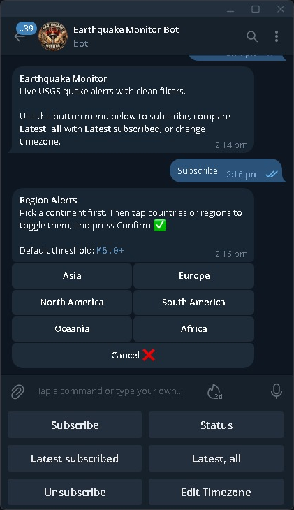
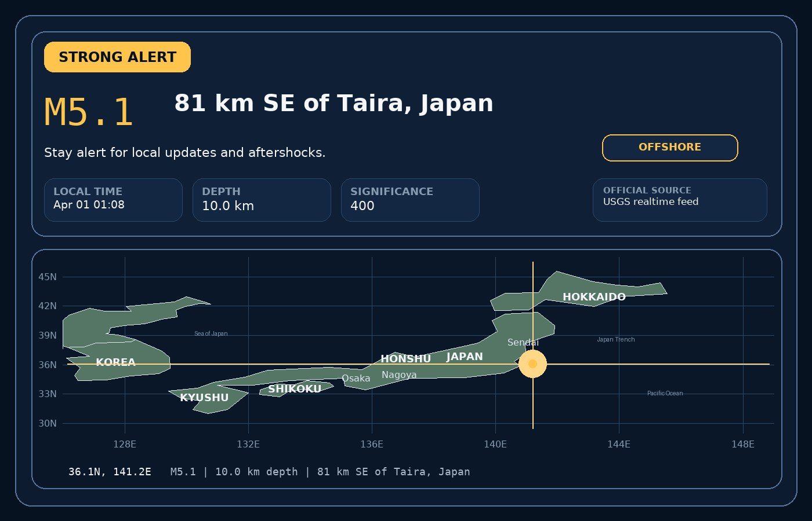

# Earthquake Monitoring Telegram Bot

A deployed Telegram bot for real-time USGS earthquake alerts. It supports region-based subscriptions, local-time formatting, queued outbound delivery, and map-based alert cards for stronger events.

## Features

- `Subscribe`: follow all alerts or choose specific countries
- `Latest, all`: show the latest stored quakes across the full feed
- `Latest subscribed`: show the latest stored quakes for each subscribed region
- `Edit Timezone`: localise quake times before using the bot
- `Status`: show current filters and, for admins, a health snapshot

## Screenshots





## Stack

- Python 3.11
- Telegram Bot API
- USGS GeoJSON feeds
- SQLite
- Pillow
- `zoneinfo` + `tzdata`
- Railway

## Design

1. The bot polls the USGS summary feed every 60 seconds.
2. New events are deduplicated by `event_id` and USGS `updated` time.
3. Matching subscriptions are queued for delivery.
4. A separate sender worker delivers text alerts or image cards.

The hosted version uses webhooks, which makes Telegram button flows more responsive than local long polling.

Two deliberate choices:
- SQLite keeps the system simple to run and deploy for a small-volume bot.
- Outbound queueing separates feed syncing from Telegram delivery, so retries and rate limits do not block user commands.

Current trade-offs:
- region matching is based on the USGS `place` text, not country polygons
- observability is lightweight: logs plus an admin-only health snapshot

## Admin Health Snapshot

Admin chats can inspect:
- transport mode
- active subscriptions
- stored quake count
- outbound queue depth
- sent / failed counts
- latest feed sync time

## Project Layout

- `src/earthquake_bot/service.py`: bot flows, subscriptions, alert decisions
- `src/earthquake_bot/storage.py`: SQLite persistence and outbound queue
- `src/earthquake_bot/usgs.py`: USGS client
- `src/earthquake_bot/telegram_api.py`: Telegram Bot API wrapper
- `src/earthquake_bot/alert_cards.py`: alert card rendering
- `src/earthquake_bot/main.py`: runtime supervisor

## Local Run

```powershell
python -m venv .venv
.venv\Scripts\Activate.ps1
Copy-Item .env.example .env
python -m pip install -e .
python -m earthquake_bot.main
```

Local development uses `polling` mode by default.

## Railway

Required setup:
- generate a public domain
- mount a volume at `/app/data`
- set `DATABASE_PATH=data/earthquake_bot.sqlite3`
- set `TELEGRAM_MODE=webhook`
- set `TELEGRAM_BOT_TOKEN`
- set `TELEGRAM_WEBHOOK_SECRET`
- set `ADMIN_CHAT_IDS`

Health endpoint:
- `GET /healthz`

## Tests

```powershell
python -m unittest discover -s tests
python -m compileall src tests
```
